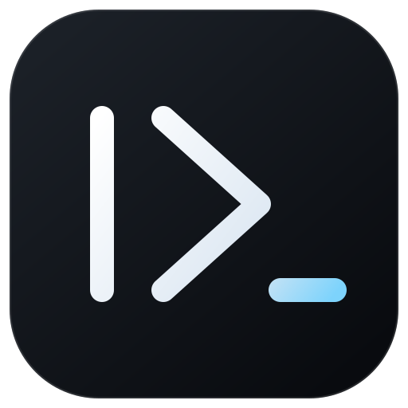

<div align="center">
  
  <h1>Anbo</h1>

  <p><strong>Lightweight Terminal-first AI-native dev workspace.</strong></p>

  <p>
    
    
    
  </p>

  <p>
    <a href="https://github.com/mramdann/anbo-ai/releases/latest">Releases</a>
    ·
    <a href="https://github.com/mramdann/anbo-ai/issues">Issues</a>
    ·
    <a href="https://github.com/crynta/terax-ai">Upstream: Terax</a>
  </p>
</div>

---

> ### 🍴 Anbo is a fork of [Terax](https://github.com/crynta/terax-ai)
> Anbo is built on top of the excellent [Terax](https://github.com/crynta/terax-ai) project by [crynta](https://github.com/crynta). All credit for the core architecture, terminal, editor, and AI foundations goes to the original Terax maintainers. Anbo is a personal fork that diverges with its own tweaks, branding, and experiments. If you're looking for the upstream project, please visit [Terax](https://github.com/crynta/terax-ai).

Anbo is a lightweight open-source terminal (ADE) built on Tauri 2 + Rust and React 19. A native PTY backend with a WebGL renderer, an agentic AI side-panel that runs against your own keys or fully local models, plus a code editor, file explorer, source control with a git graph, and a built-in browser pane. About 7-8 MB on disk. No telemetry. No account.

## Screenshots

<table>
  <tr>
    <td align="center"><br/><sub>Multi-tab terminal with WebGL rendering</sub></td>
    <td align="center"><br/><sub>Custom themes, presets, and background images</sub></td>
  </tr>
  <tr>
    <td align="center"><br/><sub>Built-in browser for dev servers and the web</sub></td>
    <td align="center"><br/><sub>Source control panel with git graph in history</sub></td>
  </tr>
  <tr>
    <td colspan="2" align="center"><br/><sub>Agentic AI workflow with edit diffs in the code editor</sub></td>
  </tr>
</table>

## Features

### Terminal

- xterm.js with WebGL renderer, multi-tab with background streaming
- GPU-accelerated block-based terminal with editor-like command input
- Native PTY backend via `portable-pty` (zsh, bash, pwsh, fish, cmd)
- Split panels (horizontal and vertical)
- Inline search, link detection, true-color
- Per-tab workspace environments on Windows (Local, or any installed WSL distro)

### Code editor

- CodeMirror 6 (supports all popular languages - TS/JS, Rust, Python, Go, C/C++, Java, HTML/CSS, JSON, Markdown, etc.)
- Inline AI autocomplete with local model support
- AI edit diffs, accept or reject hunk by hunk
- Vim mode
- Ten built-in editor themes: Atom One, Aura, Copilot, GitHub Dark / Light, Gruvbox Dark, Nord, Tokyo Night, Xcode Dark / Light

### Source control

- Stage / unstage hunks, commit (Cmd+Enter / Ctrl+Enter), push with upstream awareness
- Branch display including detached HEAD state
- Git history pane with a real commit graph (lane rendering for merges and branches)
- Commit search and filter, click through to the remote commit page

### File explorer

- Catppuccin icon theme
- Fuzzy search, keyboard navigation, inline rename, context actions
- Attach files and selections directly to the AI side-panel

### Browser

- Built-in native browser tab — navigate any HTTP/HTTPS URL, including external sites, with back / forward / reload / stop
- Curated dev-server port presets and a sandboxed iframe fallback
- AI automation tools (snapshot, click, type, scroll, screenshot, history) drive the active browser tab, plus an `anbo-browser` CLI / MCP sidecar

### Themes and customization

- Custom themes built in-app, switch between bundled presets and your own
- Create your own themes, share them or import from the community
- Background images with adjustable opacity and blur
- Editor theme is independent from the app theme

### AI

- **BYOK providers:** OpenAI, Anthropic, Google (Gemini), Groq, xAI (Grok), Cerebras, OpenRouter, DeepSeek, Mistral, plus any OpenAI-compatible endpoint
- **Local / offline:** LM Studio, MLX, Ollama
- **Agentic workflow:** plans, sub-agents, project memory via `ANBO.md`, file read / write / edit / multi-edit / grep / glob, bash with approval gating, background processes
- **Composer:** snippets via `#handle`, files via `@path`, slash commands, voice input, attach-to-agent from explorer or selection
- **Custom agents** with their own system prompt and tool subset
- **Plan mode** for multi-step work, generates and confirms before doing

## Install

Latest installers are on the [Releases](https://github.com/mramdann/anbo-ai/releases/latest) page.

### Windows notes

- On first launch Windows shows "Windows protected your PC" because Anbo isn't code-signed. Click **More info** then **Run anyway**.
- Default shell detection: `pwsh.exe` (PowerShell 7+) -> `powershell.exe` (Windows PowerShell 5.1) -> `cmd.exe`.
- WSL is a first-class workspace environment, not a wrapped subprocess.

### Linux notes

- **AppImage:** needs FUSE. Without it: `./Anbo_*.AppImage --appimage-extract-and-run`. On Wayland with rendering glitches, try `WEBKIT_DISABLE_DMABUF_RENDERER=1`. Otherwise the `.deb` / `.rpm` packages link against the system GTK stack and tend to be smoother.
- **Upstream packages:** community packages for the original Terax project (Arch AUR `terax-bin`, NixOS flake) track Terax, not Anbo. For Anbo, prefer the build-from-source instructions below or the release bundles above.

## Configure AI

1. Open **Settings -> AI**.
2. Pick a provider and paste your API key. For local inference, point Anbo at your LM Studio / MLX / Ollama endpoint.
3. Keys are written to the OS keychain via `keyring`. They never touch disk or localStorage.

## Build from source

**Prerequisites**
- Rust (stable), https://rustup.rs
- Node 20+ and [pnpm](https://pnpm.io)
- Tauri prerequisites for your platform, https://tauri.app/start/prerequisites/

**Run**
```bash
pnpm install
pnpm tauri dev          # development
pnpm tauri build        # production bundle
```

**Checks**
```bash
pnpm lint
pnpm check-types
pnpm test
cd src-tauri && cargo clippy --all-targets --locked -- -D warnings   # Rust lint (matches CI)
cd src-tauri && cargo nextest run --locked                           # or: cargo test --locked
```

## Tech stack

Tauri 2, Rust, `portable-pty`, React 19, TypeScript, Vite, xterm.js, CodeMirror 6, Vercel AI SDK v6, Tailwind v4, shadcn/ui, Zustand.

## Contributing

Issues and PRs are welcome! Feel free to open issues, suggest features, or submit pull requests against this fork. See [CONTRIBUTING.md](CONTRIBUTING.md) and the [architecture docs](docs/README.md) for more details.

## Acknowledgements

Anbo would not exist without [Terax](https://github.com/crynta/terax-ai) and its contributors. This fork keeps the original Apache-2.0 license and inherits the upstream's design and engineering. 🙏

## License

Anbo is licensed under the Apache-2.0 License. For more information on our dependencies, see [Apache License 2.0](LICENSE).
